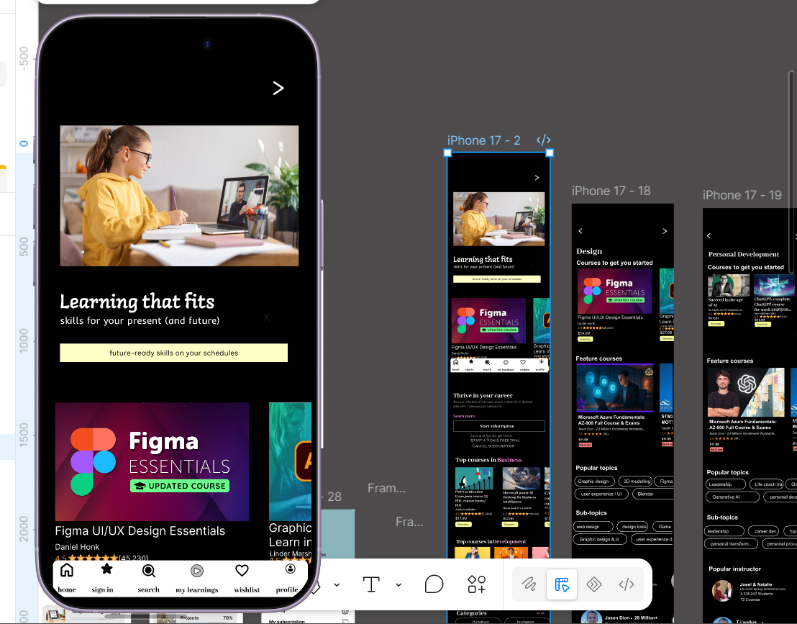

# Online Tech App for Learning

A frontend concept for an online learning platform, designed to help students 
access tech courses, track progress, and engage with learning materials in a 
simple, intuitive interface.

## Overview
This project focuses on making online tech education more accessible, with a 
clean layout that helps students navigate courses and stay on track with 
their learning goals.

## Features
- Course listings and browsing
- Student progress tracking
- Clean, distraction-free learning interface
- Responsive design for desktop and mobile

## Design
🔗 [View Figma prototype](https://www.figma.com/design/9XwVPDcDyf5ChY0ncDD5Z5/Untitled?node-id=10-4&t=fZ4B6KFxIbPFWZxk-1)

## Tech Stack
- HTML / CSS / JavaScript *(update if different)*

## Author
**Lovett Okoronkwo**  
[LinkedIn](your-linkedin-link) · [Portfolio](your-portfolio-link)
